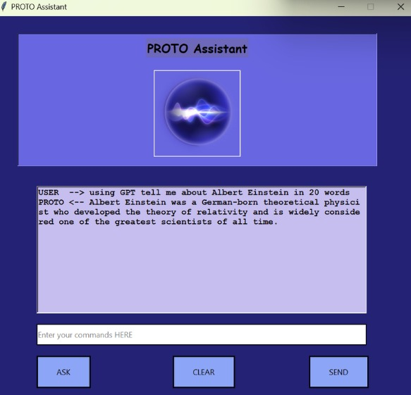
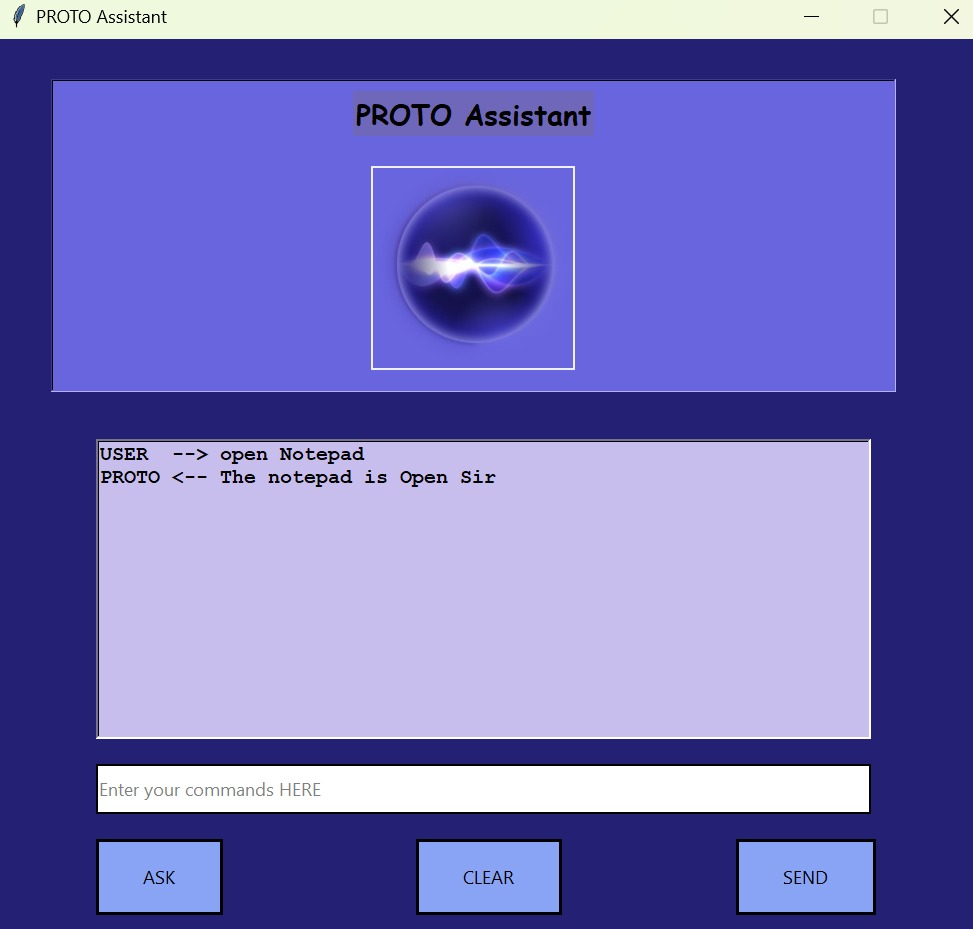
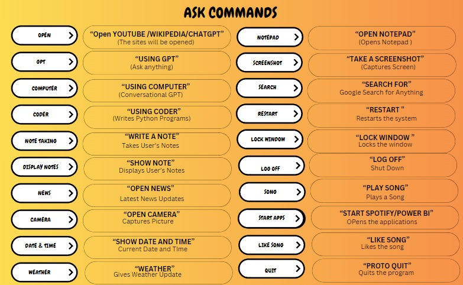

# 🤖 PROTO – A Customised AI Assistant to Optimise Personal Tasks

**PROTO** is an intelligent desktop voice assistant developed using Python. It streamlines everyday computer interactions using Natural Language Processing (NLP), Speech Recognition, and integration with powerful APIs like OpenAI. From opening applications to retrieving real-time weather and news updates, PROTO enhances productivity through voice-driven automation.

---

## ✨ Features

- 🔊 **Voice Activation**: Say "Hey PROTO!" to wake the assistant.
- 🧠 **Open AI Integration**: Understands natural language and uses GPT for intelligent replies.
- 🌐 **Web API Support**: Fetches live data (weather, news, etc.) using APIs.
- 🛠️ **Task Automation**: Open apps, perform searches, control system operations via voice.
- 🗣️ **Text-to-Speech**: Converts responses into human-like speech.
- 📅 **Date/Time Queries**: Answers queries about system date, time, and more.
- 📂 **Custom Commands**: Easily extendable for new features and tasks.

---

## 🛠 Built With

- Python (PyCharm IDE)
- `pyttsx3` – Text-to-Speech
- `SpeechRecognition` – Voice Input Recognition
- `OpenAI` – GPT Integration
- `requests`, `os`, `datetime`, `webbrowser`, `subprocess`, `ctypes`, `json`, `time`
- `Tkinter` – GUI Components
- `psutil` – System Monitoring

## 🧪 Example Commands

| Command Type     | Example |
|------------------|---------|
| GPT Integration  | "Hey PROTO, explain black holes." |
| App Launcher     | "Open Chrome" or "Launch Calculator" |
| Weather          | "What's the weather like today?" |
| System Control   | "Restart system" or "Open folder" |
| Coding Assistant | "Write a Python program for factorial" |

---

## 📸 Screenshots
### 🖥️ PROTO UI

---

### 🤖 GPT Voice Command in Action

---

### 📜 PROTO Voice Command List

---

